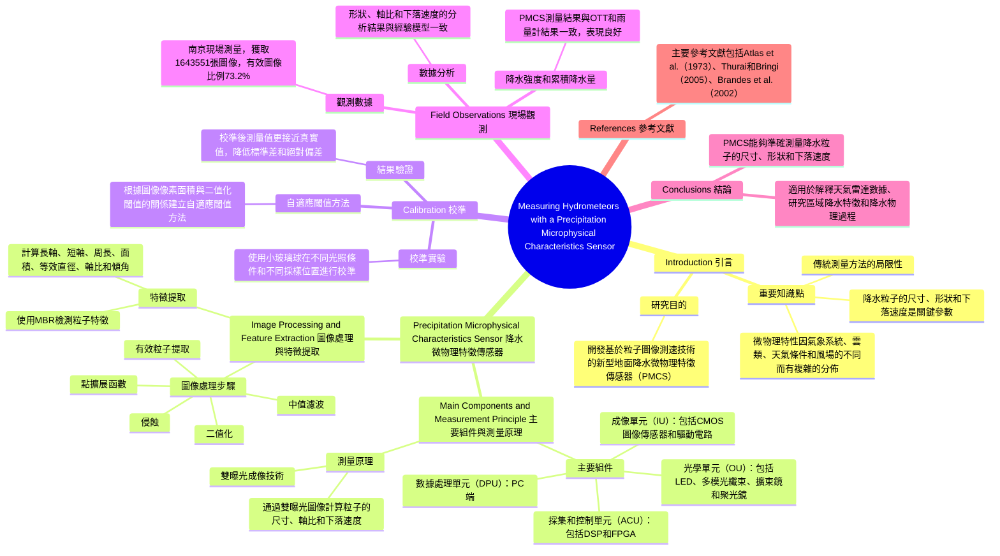

# Measuring Hydrometeors with a Precipitation Microphysical Characteristics Sensor: Calibration and Field Measurements 測量水成物的降水微物理特徵傳感器：校準和現場測量

## 目錄 Table of Contents
1. [Introduction 引言](#introduction-引言)
2. [Precipitation Microphysical Characteristics Sensor 降水微物理特徵傳感器](#precipitation-microphysical-characteristics-sensor-降水微物理特徵傳感器)
    - [Main Components and Measurement Principle 主要組件與測量原理](#main-components-and-measurement-principle-主要組件與測量原理)
    - [Image Processing and Feature Extraction 圖像處理與特徵提取](#image-processing-and-feature-extraction-圖像處理與特徵提取)
3. [Calibration 校準](#calibration-校準)
4. [Field Observations 現場觀測](#field-observations-現場觀測)
5. [Conclusions 結論](#conclusions-結論)
6. [References 參考文獻](#references-參考文獻)

## Introduction 引言
- **重要知識點**
  - 降水粒子的尺寸、形狀和下落速度是定量降水估算、電磁波傳播、土壤侵蝕、數值氣象模型微物理驗證等研究的關鍵參數。
  - 這些微物理特性因氣象系統、雲類、天氣條件和風場的不同而有複雜的分佈。
  - 傳統測量方法的局限性包括聲學或位移測量方法的精度問題以及光學散射或成像方法的誤差。
- **研究目的**
  - 開發一種基於粒子圖像測速技術的新型地面降水微物理特徵傳感器（PMCS），以同時測量自然環境中降水粒子的尺寸、形狀和下落速度。

## Precipitation Microphysical Characteristics Sensor 降水微物理特徵傳感器

### Main Components and Measurement Principle 主要組件與測量原理
- **主要組件**
  - 光學單元（OU）：包括LED、多模光纖束、擴束鏡和聚光鏡。
  - 成像單元（IU）：包括CMOS圖像傳感器和驅動電路。
  - 採集和控制單元（ACU）：包括數字信號處理器（DSP）和現場可編程門陣列（FPGA）。
  - 數據處理單元（DPU）：PC端。
- **測量原理**
  - 雙曝光成像技術，通過在一幀內的雙曝光獲取降水粒子的自相關圖像，計算粒子的尺寸、軸比和下落速度。

### Image Processing and Feature Extraction 圖像處理與特徵提取
- **圖像處理步驟**
  - 有效粒子提取、中值濾波、點擴展函數、侵蝕和二值化。
  - 使用最小邊界矩形（MBR）檢測粒子特徵，計算長軸、短軸、周長、面積、等效直徑、軸比和傾角。
- **特徵提取**
  - 通過雙曝光圖像獲取粒子形狀信息，計算粒子尺寸、軸比和下落速度。

## Calibration 校準
- **校準實驗**
  - 使用直徑為0.5至5mm的小玻璃球，在不同光照條件（晴天、陰天、夜晚）和不同採樣位置進行校準。
- **自適應閾值方法**
  - 根據圖像像素面積與二值化閾值的關係，建立自適應閾值方法，以確保測量準確性。
- **結果驗證**
  - 校準後，測得的小球直徑和軸比更接近真實值，標準差和絕對偏差降低。

## Field Observations 現場觀測
- **觀測數據**
  - 在中國南京進行現場測量，共獲取1643551張降水圖像，有效圖像比例為73.2%。
- **數據分析**
  - 形狀、軸比和下落速度的分析結果與經驗模型一致，驗證了PMCS的性能。
- **降水強度和累積降水量**
  - PMCS測量的降水強度和累積降水量與OTT和雨量計的結果一致，表明PMCS具有較高的測量準確性。

## Conclusions 結論
- PMCS能夠準確測量降水粒子的尺寸、形狀和下落速度，並且在降水強度和累積降水量測量方面表現良好。
- PMCS適用於解釋天氣雷達數據、研究區域降水特徵和研究降水物理過程。

## References 參考文獻
- 主要參考文獻包括Atlas et al.（1973）、Thurai和Bringi（2005）、Brandes et al.（2002）等，具體文獻詳見論文末尾。

